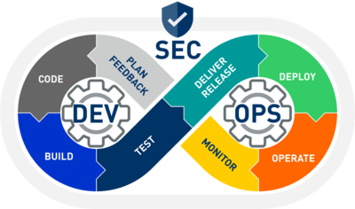

{width=50%}
# Bitacora de decisiones
## Proyecto DevSecOps - Equipo Rojo y Verde
##### integrantes:
--------
#### Instancia: sprint 12
### Anotaciones
| ACtividad | Fecha | Comentarios |
| ------ | ------ | ------ |
| Actividad de ejemplo | 12/03/2021 | Se debate sobre el cuantos repositorios utilizar |

### Bitacora 
**12 de Marzo 2021:**
Se desarrolla un debate sobre cuantos repositorios utilizar, se decide utilizar x repositorios por x motivo.

#### Observaciones:
Un punto importante que fue expuesto fue tal cosa.

#### Conclusión:
El sprint fue finalizado con exito, logrando cumplir satisfactoriamente las metas y expectativas esperadas desde el comienzo.

-------------
#### Instancia: sprint 13
### Anotaciones
| ACtividad | Fecha | Comentarios |
| ------ | ------ | ------ |
| Actividad de ejemplo | 12/03/2021 | Se debate sobre el cuantos repositorios utilizar |

### Bitacora 
**12 de Marzo 2021:**
Se desarrolla un debate sobre cuantos repositorios utilizar, se decide utilizar x repositorios por x motivo.

#### Observaciones:
Un punto importante que fue expuesto fue tal cosa.

#### Conclusión:
El sprint fue finalizado con exito, logrando cumplir satisfactoriamente las metas y expectativas esperadas desde el comienzo.